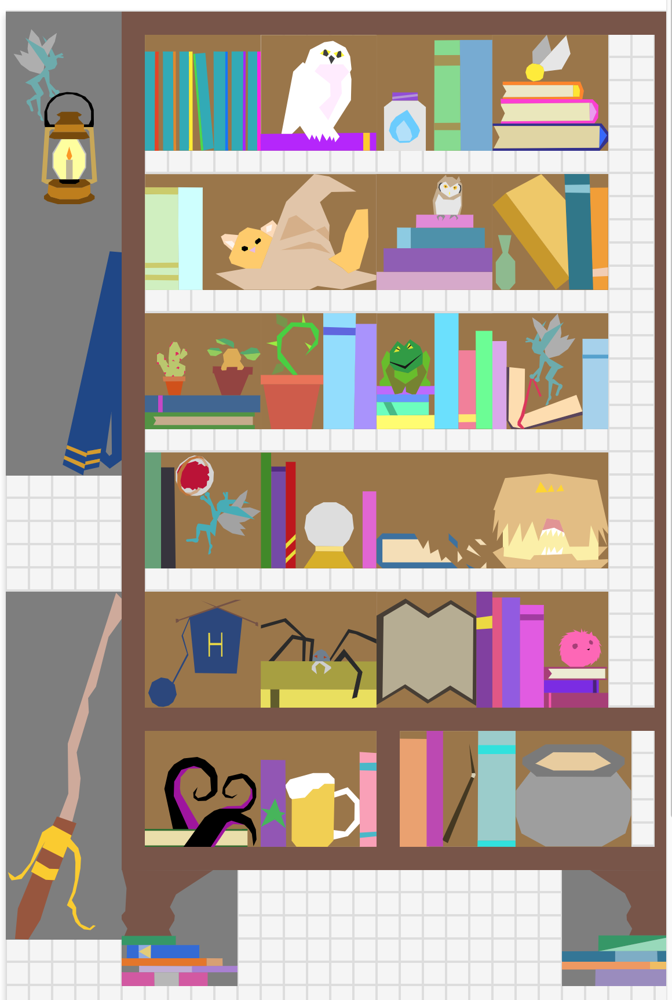
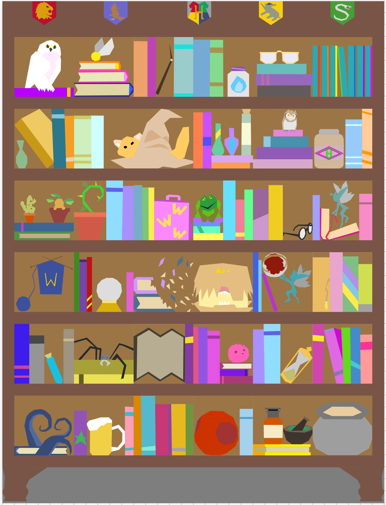

#Project Of Doom design helper

Project based on: [react-mobx-typescript-boilerplate](https://github.com/rokoroku/react-mobx-typescript-boilerplate)

The Project of Doom was a 2011 Harry Potter Quilt rebooted in 2015 as a Quilt Along for 
[Fandom in Stitches](http://www.fandominstitches.com/2015/07/harry-potter-bookcase-quilt-along.html). 

It is composed paper piecing blocks, designed by 
[Jennifer Ofenstein](https://sewhooked.com) and the 
[Fandom in Stitches](http://www.fandominstitches.com) quilting community.

This project is meant to help the design of the quilt. 
I transformed all of the weekly blocks and most of the supplemental blocks and created this web app
to help with designing a PoD quilt. 

This is very much a work in progress, done in my spare time.

Any suggestions or feedback are welcome.

Here are some examples of what you can do with this.


layout example

another layout example

If you want to play around with the code you can clone/fork/download this repo and
```
$ npm install
$ npm start
```
# License
MIT
